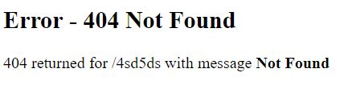
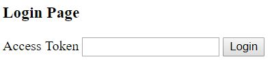
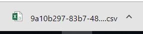
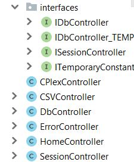
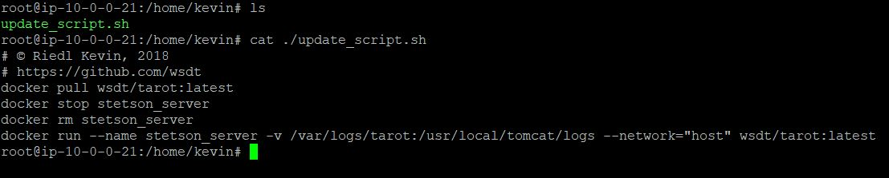
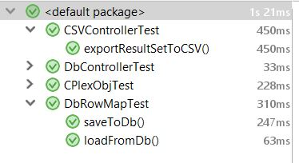

# Spring Backend
###### *© Riedl Kevin, 2018*

## What is it?
This document describes the backend of Tarot made with the Java-framework 'Spring' (using the MVC pattern).

## Features
As we had to do our work according to specific features, I decided to simply list all features which have been done and then briefly describing how to use/test/execute them etc.

Features done: 
- As a regular user of the application, I want to receive a simple error page if sth. went wrong so potential user might find a solution for that issue. 
- As a regular user of the application, I want to login via a password/pin without having separate users in the backend so that there is no issue in managing different accounts.
- As a regular user of the application, I want to be able to share my generated data via an unique link (e.g. by generating a hash of that file and using that hash as a get-param) 
- As a regular user of the application, I want to be able to download the generated file as e.g. a CSV-file so that files don't necessarily need to be shared via a link. 
- As a regular user of the application, I want some sort of session handling (implement some sort of middleware), so that I won't need to login again after every click.
- As a maintainer of the application, I want to have e.g. some small interfaces (cohesion!) to configure/change hardcoded variables, so that I won't need to look through old code. 
- Establish db connection, create interface
- Dockerize
- Tomcat logs should be accessible outside of docker
- Add analytics scripts. 
- JUnit tests
- Merge code with Bailey
- hook into real db (only localhost but outside of docker)
- parse data from CPlex directly (algo guys) -> currently Json?!!
- rowMap HashMap load Data from Db and save back (mapping). HashMap is enough. 
- show CPLEX data result as table and make it downloadable as csv (shareable via hashed link). PARSE REALLY, shorten table, human readable etc.

### Error page
> As a regular user of the application, I want to receive a simple error page if sth. went wrong so potential user might find a solution for that issue.

Basically, there are many different kinds of errors, but we separate them here only into client- and server-side errors. Server-side errors result in a simple error page every time and whenever they occur. 

Client-side errors (like 404 Resource not found) on the other hand are mostly only shown to the user when he is already authenticated/logged in. Therefore, when a user tries to access a page which does not exist and he is not logged in, he will be simply redirected to the login panel. I chose this approach for usability and security reasons.

#### Test
You can test this by accessing a random url, e.g.: [http://tarot.artifice.cc:8080/jsdjds](http://tarot.artifice.cc:8080/jsdjds) when logged in and when unauthenticated. 
**NOTE: The server was accessible via port 80, but as Mikhael wanted to add a proxy or similar what worked, too. But, today seemingly his proxy is down so you might need to access the site via port 8080.**

### Login
 > As a regular user of the application, I want to login via a password/pin without having separate users in the backend so that there is no issue in managing different accounts.
 
As we only have one user, the user can authenticate itself via an access token (= password). If wrong no access is granted and all hidden urls redirect the user back to the login panel.
 

### File-sharing
> As a regular user of the application, I want to be able to share my generated data via an unique link (e.g. by generating a hash of that file and using that hash as a get-param) 
> As a regular user of the application, I want to be able to download the generated file as e.g. a CSV-file so that files don't necessarily need to be shared via a link. 

Generated .CSV-files can be downloaded/shared via following url pattern (works only when logged in): 
**/csv/download/{source}/{filename}**

Source is currently either '_cplex_' or '_db_' to indicate whether the data has been generated from a cplex output-file or has been exported from the database via a specific query. 
All other params in source result in a 'file not found' and the user only sees a blank page as it is a direct download link. 

Filename is what the name says the name of the file. The file has to exist and the filename usually consists of numbers, letters and dashes (using a UUID). The file-extension '.csv' does not need to be supplied and would cause a file not found error.
Possible example (you need to be authenticated and as said file need to exist): 
- http://tarot.artifice.cc:8080/csv/download/cplex/9281e943-9fb8-432e-bc92-a43cf2644d1d

### Session Handling
> As a regular user of the application, I want some sort of session handling (implement some sort of middleware), so that I won't need to login again after every click.

For usability reasons the user remains logged in for a certain amount of time. 

#### Test
You can examine that by calling following URLs when logged in and when unauthenticated: 
- [/index](http://tarot.artifice.cc:8080/index)
- [/login](http://tarot.artifice.cc:8080/login)

When logged in the user gets redirected from /login to /index. When unauthenticated the user is lead from /index (or any other url) to /login.

### Cohesion
 > As a maintainer of the application, I want to have e.g. some small interfaces (cohesion!) to configure/change hardcoded variables, so that I won't need to look through old code.
 
 To keep the code readable I tried to add comments (where it makes sense) and added interfaces to separate constants from logic. All interfaces of a sub-package have been moved into "inteface"-package.
  
  
### Create generic db connection
> Establish db connection, create interface

As the real database was not ready at that time, I created a generic db interface by using JDBC and prepared statements to prevent sql injections. 
The generic logic has been put into the '_DbController.java_'. 

#### Test
You can test the database connection by executing the '_DbControllerTest.java_'-file. Please keep in mind that the database constants (e.g. password etc.) are not pushed on Github. 
Therefore, you need to put your own credentials into the template file I provided (see: controller/interfaces/IDbController_TEMPLATE.java) and rename it afterwards to IDbController.java. 

### Dockerize
> Dockerize Spring Application

To keep problems away when moving from localhost to the remote server, I decided to use [Docker](https://www.docker.com/).
The Dockerfile is in the root folder of this project and is automatically built online via [Dockerhub (see built image)](https://hub.docker.com/r/wsdt/tarot/).
For simplicity reasons I provided also a '_docker_start.sh_', which pulls the image from Dockerhub and then starts a container. 

Additionally, I provided a './update_script.sh' on the remote server itself (which is quite similar to the docker_start.sh-Script) to stop the current server instance, pull the new image and then start the updated-server version. The .SH-File is located in my user-folder (you can move it wherever you want, it's not bound to anything).

### Tomcat logs
> Tomcat logs should be accessible outside of docker

As Docker containers are lightweight virtual machines, they are some sort of isolated from the host. Moreover, a docker container is completely reset after restarting it which results in data loss. So, to extract the tomcat logs, I added a docker-volume. 
The volume is mapped as follows `/var/logs/tarot:/usr/local/tomcat/logs`.

### Google Analytics
> Add analytics scripts. 

For benchmarking we had to add a Google analytics script, which has been achieved by a .JSP-Header file to avoid redundancy.
You will find the header file in '_/webapp/WEB-INF/jsp/headers/analytics.jsp_'. This file is included by e.g. the '_index.jsp_'.

### JUnit Tests
> Add JUNIT tests

All tests are in '_./tests/**/*.java_' and can be executed as usual. All tests have been executed before the final submission.

### Frontend
> Merge code with Bailey

As I did in majority only the Backend, I needed to include the generator-View from Bailey. You will find his adapted solution in '_./webapp/WEB-INF/jsp/generator.jsp_'. 
You can view the generator view after being authenticated via: [/generator](http://tarot.artifice.cc:8080/generator).

 